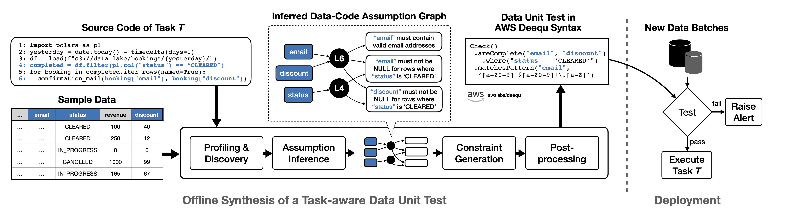

# PrismaDV: Task-aware Data Validation

PrismaDV is a compound AI system that generates task-aware data unit tests from **downstream task code** and the **data**. Given a script and a dataset, it detects accessed columns, performs data flow detection, extracts per-column assumptions, and produces executable data unit tests.



## Prerequisites

- **Python** >= 3.11
- **Node.js** >= 20.11 and **npm** >= 10
- **[uv](https://docs.astral.sh/uv/)**
- An API key for at least one LLM provider (OpenAI, Anthropic, or Gemini)

## Setup

### 1. Clone and install

```bash
git clone https://github.com/deem-data/prismadv-demo.git && cd prismadv-demo

# Backend
uv sync --all-extras --group dev

# Frontend
cd frontend && npm install && cd ..
```

### 2. Configure environment

Create a `.env` file in the project root:

```bash
# Set at least one LLM API key
OPENAI_API_KEY=sk-...
ANTHROPIC_API_KEY=sk-ant-...
GEMINI_API_KEY=...

# Optional: override default model
LLM_PROVIDER=openai        # openai | anthropic | gemini
LLM_MODEL=gpt-4o-mini
```

### 3. Run

```bash
./start.sh
```

This starts both servers:

| Service  | URL                        |
|----------|----------------------------|
| Frontend | http://localhost:3000       |
| Backend  | http://localhost:8000       |
| API Docs | http://localhost:8000/docs  |

Press `Ctrl+C` to stop both.
